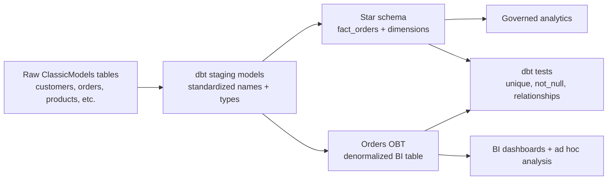

# ClassicModels Analytics Engineering with dbt

A portfolio-ready analytics engineering project that transforms raw operational order data into two analytical data products:

1. **Star schema** for governed analytics and reusable metrics.
2. **One Big Table (OBT)** for BI dashboards and analyst self-service.

The project uses a realistic order-management dataset inspired by a wholesale distribution business. It demonstrates dbt modeling, source-to-mart transformations, dimensional modeling, data quality tests, documentation, and CI-ready project structure.

---

## Why this project matters

Operational systems are optimized for transactions, not analytics. Business users often need answers such as:

- Which product lines generate the highest revenue and margin?
- Which customers drive the most order value?
- Which orders are shipped late?
- Which sales representatives own the largest accounts?
- Should BI users query a normalized star schema or a denormalized OBT?

This project converts raw order, customer, employee, office, and product data into analytics-ready models that can support dashboarding, KPI reporting, and downstream data science.

---

## Tech stack

| Layer | Tools |
|---|---|
| Transformation | dbt Core, SQL |
| Warehouse | PostgreSQL |
| Data modeling | Star schema, OBT, staging layer |
| Data quality | dbt tests, dbt-utils tests |
| Local runtime | Docker Compose |
| CI pattern | GitHub Actions |

---

## Repository structure

```text
.
├── classicmodels_modeling/        # dbt project
│   ├── models/
│   │   ├── staging/classicmodels/ # source cleanup and type standardization
│   │   └── marts/                 # star schema and OBT marts
│   ├── seeds/                     # sample raw operational data
│   ├── macros/                    # schema naming override for local demo schemas
│   ├── dbt_project.yml
│   └── packages.yml
├── docs/                          # architecture, modeling notes, interview story
├── sql/                           # business analysis query examples
├── .github/workflows/             # dbt CI example
├── docker-compose.yml             # local PostgreSQL runtime
├── profiles.example.yml           # dbt connection template
└── requirements.txt
```

---

## Data pipeline design



---

## Core models

### Staging layer

The staging layer standardizes raw source fields into consistent snake_case names and casts key fields into analytics-friendly data types.

| Model | Purpose |
|---|---|
| `stg_customers` | Customer profile, location, credit limit, sales rep mapping |
| `stg_orders` | Order header fields, status, dates |
| `stg_orderdetails` | Order line quantity and price |
| `stg_products` | Product attributes, vendor, MSRP, buy price |
| `stg_productlines` | Product line descriptions |
| `stg_employees` | Sales representative information |
| `stg_offices` | Office geography and territory |

### Star schema

| Model | Grain |
|---|---|
| `fact_orders` | One row per order line |
| `dim_customers` | One row per customer |
| `dim_products` | One row per product |
| `dim_employees` | One row per employee / sales rep |
| `dim_offices` | One row per office |
| `dim_dates` | One row per calendar date |

### OBT

| Model | Grain | Use case |
|---|---|---|
| `orders_obt` | One row per order line | BI dashboards, ad hoc analysis, business user reporting |

---

## Data quality checks

This project includes dbt tests for:

- Primary key uniqueness and not-null constraints.
- Composite uniqueness on `orders_obt` using `order_number + order_line_number`.
- Fact-to-dimension relationship integrity.
- Positive quantity and price checks.
- Accepted order status values.

Run all validations with:

```bash
dbt test --profiles-dir ..
```

---

## Local setup

### 1. Start PostgreSQL

```bash
docker compose up -d
```

### 2. Create and activate a Python environment

```bash
python -m venv .venv
source .venv/bin/activate  # Windows: .venv\Scripts\activate
pip install -r requirements.txt
```

### 3. Configure dbt profile

```bash
cp profiles.example.yml profiles.yml
```

The provided profile is configured for the local Docker PostgreSQL service.

### 4. Install dbt packages

```bash
cd classicmodels_modeling
dbt deps --profiles-dir ..
```

### 5. Load sample source data

```bash
dbt seed --profiles-dir ..
```

### 6. Build models and run tests

```bash
dbt build --profiles-dir ..
```

### 7. Generate dbt docs

```bash
dbt docs generate --profiles-dir ..
dbt docs serve --profiles-dir ..
```

---

## Example business queries

See [`sql/business_analysis_queries.sql`](sql/business_analysis_queries.sql) for example analytics questions:

- Monthly revenue trend.
- Revenue and margin by product line.
- Top customers by revenue.
- Late shipment analysis.
- Sales representative performance.

---

## Portfolio positioning

This project is designed to show analytics engineering readiness, not just SQL syntax. It demonstrates that I can:

- Translate operational data into dimensional analytics models.
- Build reusable marts with dbt.
- Apply testing and documentation to improve data trust.
- Support both governed reporting through a star schema and fast BI through an OBT.
- Explain modeling trade-offs to business and technical stakeholders.

---

## Resume bullets

```text
Built a dbt analytics engineering project that transformed raw order-management data into a tested star schema and BI-ready OBT on PostgreSQL, including staging models, surrogate keys, relationship tests, and business KPI queries.

Designed fact and dimension models for order analytics, enabling revenue, margin, customer, product-line, sales-rep, and late-shipment analysis through governed marts and self-service BI tables.
```

---

## Notes

The sample seed data is intentionally small so the repository can run quickly in a local demo or CI environment. The modeling pattern is transferable to larger production datasets in PostgreSQL, Snowflake, BigQuery, Databricks, or Redshift with adapter-specific SQL changes.
