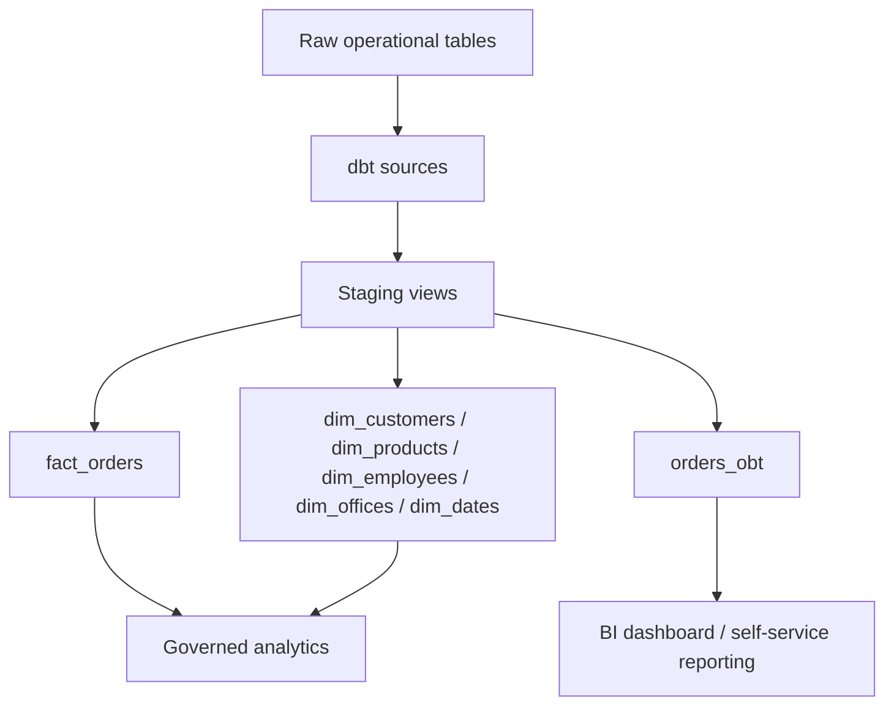

# Architecture and data flow

## Objective

The project creates analytics-ready data marts from raw operational order data. It exposes both a normalized star schema and a denormalized OBT because each serves a different analytical use case.

## Flow

## Schemas

| Schema | Purpose |
|---|---|
| `classicmodels` | Raw seed/source tables |
| `staging` | Cleaned source views |
| `star_schema` | Fact and dimension tables |
| `obt` | Denormalized order-line table |

## Key design choice

- The **star schema** reduces metric duplication and supports governed analytics.
- The **OBT** reduces join complexity and supports BI users who need a simple table for dashboards.
